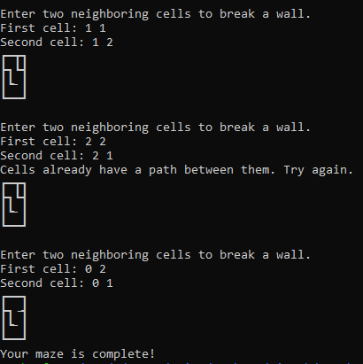

# Mazebuilder-Program
This individual class project utilized C programming to let a user turn a square grid into a maze. The purpose of this project was to teach the class how to utilize multiple files for a single project. Some topics we were learning in the C programming class that were implemented here were: header files, gcc compiling, makefiles, pointers, 2D arrays, and more.

# Background
The professor provided `Wall.h`, `Maze.h`, and `DisjointSetADT.h`.

He also provided `Wall.c`, `Maze.c`, `DisjointSetADT.c`, and `MazeBuilder.c`, but these scripts only had function names and a comment noting what each function would do. It was my job to implement these functions for this project.

The `Wall` files create the visual representation of the maze. Wall options are:
```
 ╋ ┻ ┣ ┳ ┫ ┃ ┗ ┛ ┏ ┓ ━
 ```

The `Maze` files keep track of each individual cell.

The `DisjointSetADT` files decide if two cells are in the same "set", meaning that the wall between them are broken.

# Prerequisites
If any code is changed, then files need to be recompiled. All files can be recompiled by doing:
```
make all
```

To compile specific files, here are the options:
```
make Wall.o
make Maze.o
make DisjointSetADT.o
make MazeBuilder.o
make MazeBuilder
```

If `make` is not installed yet, then the package can be installed by doing `sudo apt install make`.

# Usage
```
./MazeBuilder <number of rows> <number of columns>
```
Both indices start with 0.

*Note: the row and column indices do not need to be the same.*

Once this command is entered, the program will display a maze with the user input size. It will then ask the user for the first and second cell to look at, and based on the user's choices, the script will either:
- break the wall between the two cells and display the updated maze
- display an error saying that the wall is already broken, display the graph again, and ask for another two cells

The program will not end until there is a single path that can reach all existing cells in the maze. Or, until the user does a keyboard interrupt.

# Example
```
./MazeBuilder 3 3
```


Skipping several more lines of breaking walls, and I finally reach the end:



# Notes
This maze will look differently on different terminals. Some terminals display gaps between each wall, so the maze does not look as closed as it does in the example above.

Also, some terminals will not display mazes bigger than a certain size. They might look cut off.